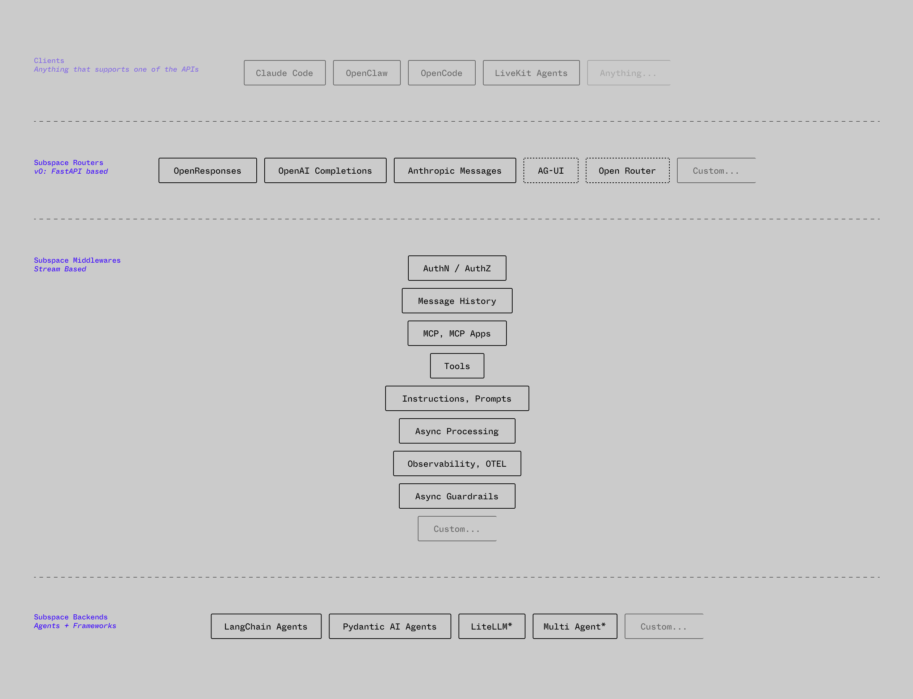

# Subspace

Subspace is infrastructure for treating agents like models.

It is not trying to be another LiteLLM or OpenRouter. It is not trying to be
another LangChain, Pydantic AI, CrewAI, or LangGraph. Those are useful tools,
and Subspace is meant to sit around them, not replace them.

The goal is simple: build agents in whatever framework makes sense, expose them
through whatever interface your clients need, and keep cross-cutting concerns
out of the agent implementation.

Auth, tool access, MCP, observability, guardrails, history, caching, delegation,
and provisioned runtimes should not have to be rebuilt inside every graph,
agent, or model wrapper. Subspace handles those concerns as streaming
middleware, so an agent can be called directly, routed through another agent,
mounted behind an OpenAI-compatible API, used from AG-UI, or evaluated as if it
were a model.

[Skip to the examples](#simple-examples)

## Why this exists

Subspace came out of a few very practical problems:

- Upgrading complex LangGraph graphs is thankless work. With 20+ graphs in
  production, upgrading LangGraph for graph #21 is not a serious plan.
- Every agent framework wants to own the whole stack: auth, tools, MCP,
  telemetry, memory, guardrails, and runtime behavior. In practice, different
  agents often need different frameworks. LangGraph, Pydantic AI, CrewAI, Koog,
  custom code - whatever fits the job.
- Agents need to be reused across interfaces. The same conversational agent may
  need to run directly, through LiveKit, through AG-UI, or with a different UI
  surface based on modality, including MCP Apps/UI.
- Infrastructure concerns should be decoupled from model logic. Auth, request
  filtering, access control, telemetry, MCP access, message history, caching,
  PII handling and guard rails should not be hard-coded into every agent.
- Evaluating an agent should be as easy as evaluating a model. Observing raw
  model calls is useful, but many failures only show up when the full agent is
  treated as the unit under test.
- Sandboxed agent runtimes can create a new kind of lock-in. Claude Agent SDK,
  Codex, Cursor, and similar systems are excellent for some tasks, but you
  should not have to couple your whole product to one harness.
- Server-side tool calling should still be visible. Subspace can execute tools
  on the server while preserving the stream of what happened, which makes
  client UIs, audit trails, and MCP Apps much easier to build.

## How it works

Subspace is built around a streaming middleware chain, similar in spirit to ASGI
middleware:



```text
Interface -> Middleware Chain -> Backend
```

- Interfaces translate wire formats into Subspace stream events and back again.
- Middlewares wrap the request and response stream.
- Backends terminate the chain and run a model, graph, agent, or hosted runtime.

The internal stream model is heavily inspired by the OpenResponses API because
it is one of the cleaner ways to represent long-running agent behavior: text
deltas, tool calls, tool outputs, errors, interruptions, and final responses all
fit into the same event stream.

Subspace adds server-side function calls for work that should happen inside the
infrastructure layer, similar in spirit to hosted tools such as web search. For
ephemeral or sandboxed agents, the runtime model also borrows ideas from ACP:
provisioning, permission requests, and other control-plane events belong in the
agent stream, not bolted on beside it.

## Simple Examples

### Simple LiteLLM setup

This exposes a LiteLLM-backed agent as an OpenAI Responses-compatible endpoint:

```python
# app.py
from subspace import LitellmBackend, OpenResponsesRouter, SubspaceApp, SubspaceMount

mount = SubspaceMount(
    interfaces=[OpenResponsesRouter(prefix="/v1")],
)

mount.agent(
    "assistant",
    backend=LitellmBackend(model="openai/gpt-4o-mini"),
)

app = SubspaceApp(mount, title="Subspace LiteLLM Example")
```

Run it with:

```sh
OPENAI_API_KEY=... uv run uvicorn app:app --reload
```

Then call the agent like a model:

```sh
curl -N http://localhost:8000/v1/responses \
  -H "Content-Type: application/json" \
  -d '{
    "model": "assistant",
    "input": "Write a haiku about middleware.",
    "stream": true
  }'
```

### LangChain-esque Runnable Backend

For LangChain or LangGraph, wrap a runnable or a factory with
`LangchainBackend`. The factory receives the Subspace request context and the
interrupt tools generated from the request tools.

```python
# app.py
from langchain.chat_models import init_chat_model
from langgraph.prebuilt import create_react_agent

from subspace import OpenResponsesRouter, SubspaceApp, SubspaceMount
from subspace.contrib.backends.langchain import LangchainBackend


def make_agent(ctx, interrupt_tools):
    model = init_chat_model("openai:gpt-4o-mini")
    return create_react_agent(model, tools=interrupt_tools)


mount = SubspaceMount(
    interfaces=[OpenResponsesRouter(prefix="/v1")],
)

mount.agent(
    "researcher",
    backend=LangchainBackend(make_agent),
    description="A LangChain/LangGraph-backed research agent.",
)

app = SubspaceApp(mount, title="Subspace LangChain Example")
```

The client still calls it as a model:

```sh
curl -N http://localhost:8000/v1/responses \
  -H "Content-Type: application/json" \
  -d '{
    "model": "researcher",
    "input": "Find the main tradeoffs in using server-side tools.",
    "stream": true
  }'
```

## Features

1. Expose an agent as a model through different interfaces. Built-in routers can
   present agents through familiar APIs, while clients can still send tools,
   instructions, messages, and other request options.
2. Build reusable middleware for infrastructure concerns: OAuth, scope checks,
   rate limits, request filtering, PII handling, telemetry, MCP access,
   conversation history, caching, and more.
3. Keep the core middleware chain framework-agnostic. The included routers are
   FastAPI-based, but the chain and backends can be integrated elsewhere.
4. Avoid subscription or platform lock-in. Wrap each agent in a Subspace stack
   and run it in your own infrastructure.
5. Treat whole agents as evaluation targets. If an eval framework can call a
   model-compatible endpoint, it can evaluate the full agent behavior.
6. Support server-side tools without hiding them from clients. Tools can run in
   middleware while still producing visible stream events.
7. Leave room for provisioned agents. Hosted or sandboxed agents can be modeled
   as backends with lifecycle, permissions, and runtime capabilities instead of
   being forced into a specific interface. While Subspace provides an ACP
   interface, the important part is around being able to inject additional
   instructions, filter malicious instructions, track usage etc.

## Opinionated Features

These are included because they solve common production problems, but they are
deliberately not meant to be neutral protocols.

1. Use the basic multi-agent backend when several agents need to hand off a
   conversation. This is deliberately not A2A; it is an opinionated backend that
   injects a `delegate_to` tool and the instructions needed for whole-conversation
   handoffs.
2. Emit retraction events when streamed output needs to be removed from the
   client. The retraction middleware can signal that a message or text segment
   should be pulled back, giving clients a clean way to update the UI after
   moderation, policy checks, or other server-side interventions.

## How to contribute

This is a complete rewrite of an approach I worked on for another project,
turning it into an actual library. I'm sure there are plenty of use cases
missing. Please open an issue before spending serious time on a new feature or
large refactor, especially if it touches the event model, middleware lifecycle,
interfaces, or backend contracts.

Maintainers are welcome. The project needs people who care about boring
infrastructure details: compatibility, streaming behavior, typed extension
points, docs, tests, and not accidentally turning this into another everything
framework.

### Good contributions

- New backends for real agent runtimes or model frameworks.
- New interfaces/routers that map cleanly onto the internal stream model.
- Middleware that handles infrastructure concerns without coupling itself to one
  model provider or agent framework.
- Storage adapters for conversation history and other stateful middleware.
- Tests that pin down streaming edge cases, cancellation, errors, lifecycle
  behavior, and wire-format compatibility.
- Documentation, examples, and honest notes about where the abstraction does not
  fit.

### Before opening a PR

Use `uv` and Python 3.13+.

```sh
uv sync
uv run ruff check src tests examples
uv run ruff format src tests examples
uv run pytest
```

If your change touches examples, make sure the relevant example still starts.
If it touches a router, include tests for both streaming and non-streaming
responses. If it touches middleware, include tests for ordering, errors, and
terminal events.

### Code style

- Keep the core async throughout.
- Prefer explicit typed models over dictionaries and stringly-typed feature
  flags.
- Keep `StreamEvent` open for custom middleware/router events. If code only
  understands built-in events, match against the built-in event types explicitly.
- Middleware and backend streaming methods should return
  `AsyncIterator[StreamEvent]`; do not type them as coroutines returning streams.
- Avoid framework-specific logic in core middleware. Put implementation-specific
  integrations under `contrib/` unless they are part of the framework spine.
- Do not add runtime YAML/TOML configuration. Prefer Python objects, Pydantic
  models, and environment-driven settings where needed.
- Keep public methods documented with at least a short one-line docstring.

### Compatibility expectations

Subspace should be conservative about public contracts. Changes to event shapes,
item models, middleware lifecycle, backend protocols, and router behavior need
tests and a migration note. If a feature only works for one provider, framework,
or hosted runtime, make that explicit in the docs and keep it out of the core
unless there is a strong reason.

### Security and safety

Be careful with middleware that executes tools, filters user input, handles
credentials, or talks to external runtimes. Include tests for denial paths, not
just the happy path. Do not log secrets, raw auth headers, or full tool payloads
unless a caller has explicitly opted into that behavior.
